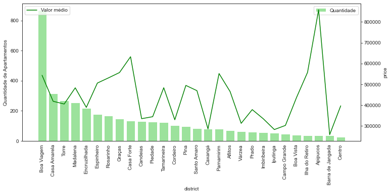
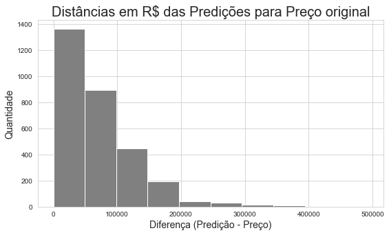
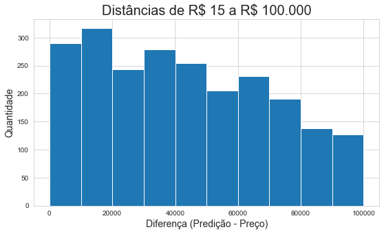

# Prevendo Preços de Apartamentos de Recife
 Este projeto tem o selo Meigarom de validação! Hehe Confira a [consultoria](https://www.youtube.com/watch?v=cCpnbD7kpCQ) e o [notebook](https://nbviewer.jupyter.org/github/pauloreis-ds/Projetos/blob/master/Previs%C3%A3o%20-%20Pre%C3%A7o%20Apartamentos%20Recife/notebooks/Refactoring.ipynb) em que aplico e examino as diferenças e vantagens do que aprendi.

 

[App](https://share.streamlit.io/pauloreis-ds/recife_apartments_prediction/main/App.py)

    Sumário:
        1 - Web Scraping.
        2 - Análise Exploratória.
        3 - Data Cleaning.
        4 - Análise dos dados.
        5 - Construção do Modelo.
        6 - Resultados.
        7 - Melhorias. O que faria diferente?
        8 - Sumário dos notebooks:
        Resources
        Observações
        

  

**Identificando o problema.**

> Por se tratar de um problema de Regressão (predição de variáveis contínuas), 
algoritmos como LinearRegression() ou DecisionTreeRegressor() podem ajudar.

###  1 - [Web Scraping.](https://nbviewer.jupyter.org/github/pauloreis-ds/Projetos/blob/master/Previs%C3%A3o%20-%20Pre%C3%A7o%20Apartamentos%20Recife/notebooks/0%20Web%20Scraping%20Im%C3%B3veis.ipynb)
Obtive os dados dos sites [pe.olx](https://pe.olx.com.br/), [redeimoveispe](https://www.redeimoveispe.com.br/) e [vivareal](https://www.vivareal.com.br/?utm_source=google&utm_medium=cpc&utm_campaign=Institucional-VivaReal&gclid=EAIaIQobChMI0u-7iMa06wIVgg2RCh3e0AV4EAAYASAAEgKsaPD_BwE&utm_referrer=https%3A%2F%2Fwww.google.com%2F&__vt=gv:a). 
E também reaproveitei informações do [protótipo](https://github.com/pauloreis-ds/Projetos/tree/master/Previs%C3%A3o%20-%20Pre%C3%A7o%20Im%C3%B3veis) deste projeto 
(cujos dados vieram do [ZAP Imóveis](https://www.zapimoveis.com.br/)).

> O objetivo era coletar estas informações sobre os apartamentos: 
[Localização, Preço, Tamanho, Número de quartos, banheiros e vagas para estacionar]

### 2 - [Análise Exploratória.](https://nbviewer.jupyter.org/github/pauloreis-ds/Projetos/blob/master/Previs%C3%A3o%20-%20Pre%C3%A7o%20Apartamentos%20Recife/notebooks/1%20An%C3%A1lise%20Explorat%C3%B3ria%20Im%C3%B3veis.ipynb)
Com um olhar mais voltado para a estrutura dos dados. _Quais problemas eles apresentam e como posso driblá-los?_

> Uma caminhada em cada coluna da tabela para identificar mudanças que precisarão acontecer. 
Além de refletir como aplicar as alterações.

### 3 - [Data Cleaning.](https://nbviewer.jupyter.org/github/pauloreis-ds/Projetos/blob/master/Previs%C3%A3o%20-%20Pre%C3%A7o%20Apartamentos%20Recife/notebooks/2%20Data%20Cleaning%20Im%C3%B3veis.ipynb)
Limpeza dos dados. Tratamento dos elementos da tabela. Transformação e conversão dos tipos de dados para que eles possam ser utilizados.

> Extraindo valor das variáveis.

### 4 - [Análise dos dados.](https://nbviewer.jupyter.org/github/pauloreis-ds/Projetos/blob/master/Previs%C3%A3o%20-%20Pre%C3%A7o%20Apartamentos%20Recife/notebooks/3%20An%C3%A1lise%20dos%20dados%20Im%C3%B3veis.ipynb)
Em um foco mais descritivo, observar e buscar insights. 
Já com os dados limpos, entender e encontrar elementos que danifiquem a " _precisão_ " do modelo.

> Caçada de outliers e dados inconsistentes...
     
### 5 - [Construção do Modelo.](https://nbviewer.jupyter.org/github/pauloreis-ds/Projetos/blob/master/Previs%C3%A3o%20-%20Pre%C3%A7o%20Apartamentos%20Recife/notebooks/4%20Modelagem%20Im%C3%B3veis.ipynb)
 
Finalmente "prevendo" preços de apartamentos. 
   
### 6 - Resultados.
Observando os gráficos notamos que o modelo identificou um padrão nos dados e consegue "seguir o fluxo" dos preços, mas ele não é preciso. A diferença nos valores parece ser pequena __(e por vezes é)__, mas lembrando que o preço está em milhão, cada centimetro é bastante dinheiro kkkkk. 
 
    Preço Real -- > 380000    Preço Real -- > 130000    Preço Real -- > 800000
    Predição   -- > 376028    Predição   -- > 181342    Predição   -- > 677054
   
> ps: a porcentagem média das diferenças entre o valor real e a predição é de 15\%. Geralmente variando entre 1 e 30\%. 85\% dos dados tem uma variação inferior a 30\%, que em termos matemáticos seriam os "erros aceitáveis". **Entretanto, em termos de negócio**, aproximatamente 75\% dos valores previstos tem diferença menor que R\$ 100 mil dos valores reais. Em outras palavras, **75\% das previsões se distanciam (a mais ou a menos) de 15 a 99992 reais do preço real.**
   
   
Diferença aparentemente pequena entre os valores reais e as predições:
    

  

    

Modelo identificou determinado padrão nos dados:    

  

 

Quantidade de predições de acordo com a quantia (em R\$) que elas se afastam dos valores reais (também conhecida como... erro).

> Aproximadamente 50% delas estão abaixo de 50.000. Em termos de negócio, dependendo de quanto estejamos dispostos a "errar", esse resultado pode ser considerado ruim ou mais ou menos... e talvez... apenas um talvez, bom. kkkkk
>
> E aproximadamente 1000 observações, 33% das estimativas tem entre 50.000 e 100.000 reais de diferença para o valor real.

  
  

[Extra (testes de ML) Imóveis.ipynb](https://nbviewer.jupyter.org/github/pauloreis-ds/Projetos/blob/master/Previs%C3%A3o%20-%20Pre%C3%A7o%20Apartamentos%20Recife/notebooks/5%20Extra%20%28testes%20de%20ML%29%20Im%C3%B3veis.ipynb)

[Código Modelo "Otimizado"](https://nbviewer.jupyter.org/github/pauloreis-ds/Projetos/blob/master/Previs%C3%A3o%20-%20Pre%C3%A7o%20Apartamentos%20Recife/notebooks/6%20-%20Modelo%20Otimizado.ipynb)
   
### 7 - Melhorias. O que faria diferente?

Primeiramente, a métrica que me guiaria seria a princípio tentar diminuir a frequência de aparição dos valores de erros "ingênuos" (de 50 a 100 mil). Ingênuos porque há vezes em que esse erro é negativo, o que em um contexto de compra, por exemplo, significaria que a empresa vezes teria um custo a mais, vezes teria um "desconto" por estimar que o custo seria maior que o real. Além de eliminar de vez as elevadas diferenças acima de 100 mil reais.

**1 - Coleta de Dados.**

Após aplicar alguns testes, penso que para melhorar a estimativa do algoritmo aumentar a quantidade de informações seja a melhor opção.

**2 - Domínio da Área**

É provável que algumas decisões minhas não tenham sido as melhores. E a interação com algum especialista no assunto com certeza guiaria certas decisões para um caminho 
mais assertivo. Até mesmo por o problema abordado nesse projeto ser, de certo modo, genérico __("Prever Preços de Apartamentos")__, pois decidi desconsiderar questões 
como "A quem a solução será útil? Como esse cliente fará uso dela? De que maneira ele se beneficiará?".

**3 - More Features**

E, em um processamento profissional, utilizar mais fatores que influenciam o preço, como nível de segurança local, facilidades e opções de lazer, estado de conservação estrutural ("idade"), entre outros.

### 8 - Sumário dos notebooks (principais):

**Web Scraping.**

    1 - pe.olx
            1.1 - Código nos dados
            1.2 - Otimizando o código
            1.3 - Criando um arquivo .csv
    2 - redeimoveispe
            2.1 - Investigando as Tags
            2.2 - Copiando e coland-- Otimizando o código
            2.3 - Criando um arquivo .csv
    3 - vivareal
            3.1 - Em busca das Tags
            3.2 - Coletando os dados
            3.3 - .csv

**Análise Exploratória.**

    Identificando os desafios.
    1 - pe.olx
        1.1 - ['Preço']
        1.2 - ['Localizações']
        1.3 - ['Outros']
    2 - redeimoveispe
        2.1 - ['Preço']
        2.2 - ['Localizações']
        2.3 - ['Outros']
    3 - vivareal
        3.1 - ['Preço']
        3.2 - ['Localizações']
        3.3 - ['Outros']

**Data Cleaning**

    1º DataFrame
            Removendo NaN
            1.1 - ['y_price']
            1.2 - ['X_location']
            1.3 - ['Quarto'] ['Tamanho'] ['Garagem']
                1.3.1 ['Quarto']
                1.3.2 ['Tamanho']
                1.3.3 ['Garagem']
            1.4 Salvando Progresso (to_pickle)
        2º DataFrame
            2.1 - ['y_price']
            2.2 - ['X_location']
            2.3 - ['Quarto'] ['Banheiro'] ['Garagem'] ['Tamanho']
                2.3.1 ['Quarto']
                2.3.2 ['Banheiro']
                2.3.3 ['Garagem']
                2.3.4 ['Tamanho']
            2.4 Salvando Progresso (to_pickle)
        3º DataFrame
            O universo conspira a quem favor?

**Análise dos dados**

    Em busca de irregularidades.
        1 - Preço por m²
        2 - Relação Banheiros por Quartos
        3 - Estimando quantidade de banheiro (2º DataFrame)
            3.1 - Preço por m²
            3.2 - Relação Banheiros por Quartos
        4 - Unindo as tabelas
            Salvando Progresso \o\|o|/o/
        5 - Garagem e Bairros 
            (dados extras)
            5.1 Garagem
            5.2 Bairros
        6 - Reanálise da análise .-.
        
**Modelagem**

    Simples Feature Engineering
    1 - Criando modelo 
        Linear Regression
            Visualizando Resultados
        Decision Tree Regressor    

**Resources.**

    Python 3.7
    Packages: requests, bs4, 
              pandas, matplotlib, seaborn,
              sklearn, json.
  
**Observações**
    
    observação das obsobservações: semanas e semanas no futuro, felicíssimo estou por ter conseguido finalizar o deploy utilizando o streamlit.
                                   Estou estudando-o para um novo projeto e decidi voltar aqui e tentar novamente. Consegui hehe! \(*O*)/
                                   Este é o [código](https://github.com/pauloreis-ds/recife_apartments_prediction) da aplicação em funcionamento.

> A aplicação web (inicial) não é de minha autoria, copiei o código do [Code Basics](https://github.com/codebasics/py/tree/master/DataScience/BangloreHomePrices) (que me inspirou a trabalhar nesse tema) o estudei e alterei para se encaixar ao meu projeto. Como a finalidade era a prática e experiência, o deploy da aplicação web (que falhou :'( por isso gravei o [vídeo](https://www.youtube.com/watch?v=wj0uYYJ3ZNA) de seu funcionamento) veio como um extra. Foi bem divertido fazê-lo funcionar e buscar como torná-lo disponível a todos.

  

           
           

---
