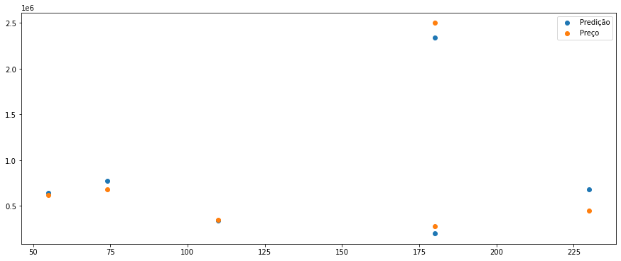

Prevendo Preço de Apartamentos de Recife - Protótipo.

> **Considerações iniciais|pessoais.**
>
> Por que postar um projeto que (na minha visão) "falhou"? Sim, _o resultado final não me agradou_ (**mesmo com um "score" de 95%**). Em contra partida aprendi Muitíssimo.
De certo modo foi bem diferente das práticas que vinha fazendo. Não só por ter o trabalho de pensar como operar, mas pelos desafios de caminhar sem um guia em um tutorial
mostrando o passo a passo, exatamente o que fazer.

    Sumário: 
        1 - Web Scraping.
        2 - Análise Exploratória.
        3 - Limpeza dos dados (Data Cleaning).
        4 - Análise dos dados.
        5 - Construção do Modelo.
        6 - Resultados.
        7 - Melhorias. O que faria diferente?
        8 - Sumário dos notebooks:
        Resources

**Identificando o problema.**

> Por se tratar de um problema de Regressão (predição de variáveis contínuas), 
  algoritmos como LinearRegression() ou DecisionTreeRegressor() podem nos ajudar.

### 1 - [Web Scraping.](https://nbviewer.jupyter.org/github/pauloreis-ds/Projetos/blob/master/Previs%C3%A3o%20-%20Pre%C3%A7o%20Im%C3%B3veis/notebooks/0%20Im%C3%B3veis%20-%20Processo%20de%20Web%20Scraping%20.ipynb) 
Obtive os dados do site [ZAP Imóveis](https://www.zapimoveis.com.br/) e para fins didáticos decidi manter todo o progesso (com erros, acertos, dúvidas e frustrações) à mostra,
acompanhando minha linha de raciocínio enquanto tento sair vitorioso em cada um dos desafios.

> O objetivo era coletar estas informações sobre os apartamentos:  
[Localização, Preço, Tamanho, Número de quartos, banheiros	e vagas para estacionar]

### 2 - [Análise Exploratória.](https://nbviewer.jupyter.org/github/pauloreis-ds/Projetos/blob/master/Previs%C3%A3o%20-%20Pre%C3%A7o%20Im%C3%B3veis/notebooks/1%20Im%C3%B3veis%20-%20An%C3%A1lise%20Explorat%C3%B3ria.ipynb) 
Com um olhar mais voltado para a estrutura dos dados. _Quais problemas eles apresentam e como posso driblá-los?_

> Uma caminha em cada coluna da tabela para identificar mudanças que precisarão acontecer. 
  Além de refletir como aplicar as alterações.

Nesse ponto também começo a transformar os dados com irregularidades mais aparentes (Data Cleaning)

> Eliminando NaN, modificando dados para alterar seu tipo, etc...

### 3 - [Limpeza dos dados (Data Cleaning).](https://nbviewer.jupyter.org/github/pauloreis-ds/Projetos/blob/master/Previs%C3%A3o%20-%20Pre%C3%A7o%20Im%C3%B3veis/notebooks/2%20Im%C3%B3veis%20-%20Data%20Cleaning%20%28strings%29%20Localiza%C3%A7%C3%A3o.ipynb)
Continuação do processo anterior, o qual tratei das variáveis numéricas. Esse trecho foi separado para o tratamento de strings.
Sendo mais específico, as localizações se apresentaram como um verdadeiro desafio. Não foi tão simples conseguir o que queria delas.

> Extraindo valor das variáveis nominais.

ps: foi a seção que mais me deu trabalho, raiva, risos e alegria! rsrsrsrs

### 4 - [Análise dos dados.](https://nbviewer.jupyter.org/github/pauloreis-ds/Projetos/blob/master/Previs%C3%A3o%20-%20Pre%C3%A7o%20Im%C3%B3veis/notebooks/3%20Im%C3%B3veis%20-%20An%C3%A1lise%20dos%20Dados.ipynb)
Em um foco mais descritivo, observar e buscar insights. 
Já com os dados limpos, entender e encontrar elementos que danifiquem a _"precisão"_ do modelo.

> Caçada de outliers e dados inconsistentes...

### 5 - [Construção do Modelo.](https://nbviewer.jupyter.org/github/pauloreis-ds/Projetos/blob/master/Previs%C3%A3o%20-%20Pre%C3%A7o%20Im%C3%B3veis/notebooks/4%20Im%C3%B3veis%20-%20Modelagem.ipynb)
Finalmente "prevendo" preços de apartamentos.

### 6 - Resultados.
 
Observando os gráficos notamos que o modelo identificou um padrão nos dados e consegue "seguir o fluxo" dos preços, mas ele não é preciso. 
A diferença nos valores parece ser pequena, mas lembrando que o preço está em milhão, cada centimetro é muito dinheiro kkkkk.

        Pensando como um possível "usuário" desses resultados. 
        Receber a notícia de que a diferença entre o valor esperado
        e o valor real ser de 80 ou 100 mil reais não me agradaria muito.
        Esse não é um erro tolerável. 
    
        Preço Real --> 280000     Preço Real --> 317500
        Predição ----> 194707     Predição ----> 215905
        Diferença ---> 85292      Diferença ---> 101594
                
Diferença aparentemente pequena entre os valores reais e as predições:

  

Sim, o modelo identificou determinado padrão nos dados:

  

### 7 - Melhorias. O que faria diferente?

**1 - Web scraping melhor.**

Trabalharia mais nesse ponto, pois tive a impressão de que a má qualidade dos dados e o resultado final do projeto estão mais relacionados a como realizei esse processo 
do que outros fatores.

**2 - Utilizar Regex para resultados possivelmente mais eficientes?**

O tratamento de strings realmente se mostrou um desafio. Consegui superá-lo sem o uso das _Regular Expressions_. Porém, acredito que ter conhecimento delas poderia ter 
retornado resultados mais efetivos (não necessariamente mais rápidos).

**3 - Melhor planejamento inicial.**
    
O propósito maior desse projeto era simplesmente terminá-lo _" Para sentir o processo, ter a experiência e redundantemente ver com meus próprios olhos."_ 
Por conta disso acabei não me planejando bem. Pensava no que precisava fazer e fazia, sem refletir se era a melhor escolha de ação. Essa animação por 
"prever preço de apartamentos" me cegou para, por exemplo, o fato de a coleta de dados me ofercer dados de imóveis (como casas), além de apartamentos.

Além disso, mesmo sendo guiado por certas questões, não considerei criar perguntas/hipóteses do negócio... que me guiariam rumo a atitudes mais sistemáticas e assertivas.
Minha curiosidade e organização naturais podem ter me ajudado a me "manter na linha". Entretanto, a sistematização e o planejamento inicial são aspectos que devo implementar 
a partir de já.

### 8 - Sumário dos notebooks:
**0 - Web Scraping.**

    0 - Requisições
        Como obter dados de todas as páginas?
    1 - Como obter os dados desejados?
        1.1 Primeiros problemas 
        1.2 De volta pro futur--web scraping
            Código nos dados:
                Preço do apartamento
                Tamanho do apartamento, número de: Quartos, Banheiros, Vagas para estacionar
    2 - Efetivamente Coletando os dados.
    3 - Otimizando o código
    4 - Criando um arquivo .csv e finalizando a fase 1 do projeto.
        ps: Nunca, mas nunca subestime o retardo humano (-.-' )
    5 - Código final! \(*O*)/
    

**1 - Análise Exploratória.**

    1 - Explorando os Dados
        Identificando os desafios
            1.1 ['Localização']
            1.2 ['Preço']
            1.3 ['Tamanho (m2)']
            1.4 ['Número de quartos'] e ['vagas para estacionar']
            1.5 ['Número de banheiros']
    2 - Manipulação dos dados (Limpeza - Data Cleaning)
        Eliminando coluna ['Unnamed: 0'] e linhas sem preço ("Sob consulta")
        2.1 ['X_tamanho_em_m2']
        2.2 ['y_preço']
        2.3 ['X_número_de_quartos'], ['X_vagas_para_estacionar'] 
            ['X_número_de_banheiros']
        2.4 Salvando Alterações
        

**2 - Limpeza dos dados (strings).**
       
     1 - Investigando a ['Localização']
        Criando ['Bairro']
        1.1 Descobrimento do Brasi-- bairros em Recife.
            Insights ~(*-*~ ) ~(*-*)~ (~*-*)~
        1.2 Lidando com as irregularidades.
            Sorte ou Destino? Bom... Respostas!
        1.3 Finalizando a investigação 
            (três papéis, uma tesoura)
            (uma tesoura, uma Montanha)
            Caminhando nas ['Localizações']
            Finalizando o tratamento das strings.
                Criando nova tabela e salvando o progesso! \o\|o|/o/

**3 - Análise dos dados.**

    1 - Análise Exploratória
            Ritual Padrão
            Visão Estatística
            1.1 Tamanho em m2
            1.2 Preço por m²
            1.3 Valores únicos das colunas por Número de Quartos
            1.4 Valores únicos das colunas por Número de Vagas no Estacionamento
            1.5 Valores únicos das colunas por Número de Banheiros
            1.6 Valores únicos das colunas por preço
            Visão com gráficos

**4 - Construção do Modelo**

    1 - Feature Engineering
        X_preço_po_m2
        X_bairro = 'Outra'
    2 - Finalizando preparação
    3 - Criando modelo 
        Linear Regression
    Visualizando Resultados (repensando plano de ação)
    

#### Resources.
    
    Python 3.7
    Packages: requests, bs4, pandas, matplotlib, seaborn
              sklearn.

---
