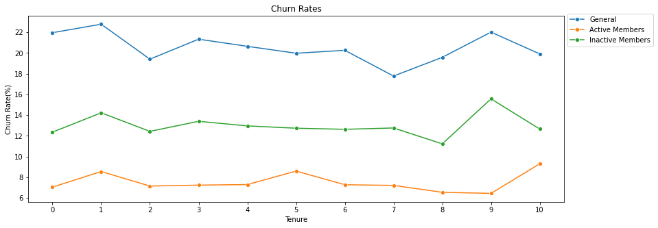
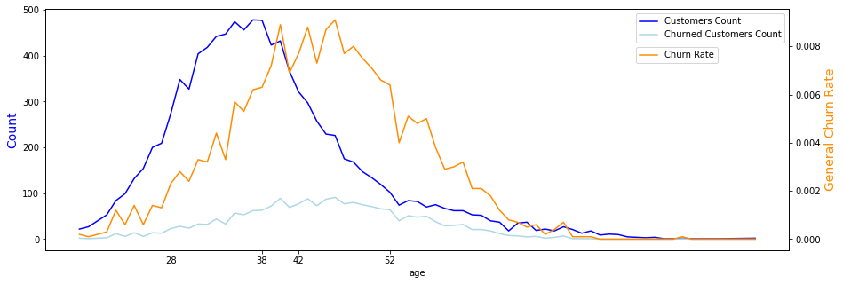
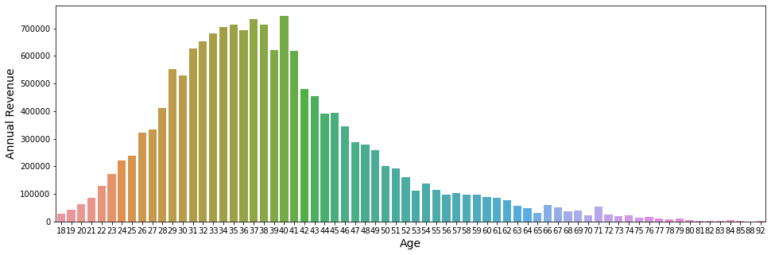
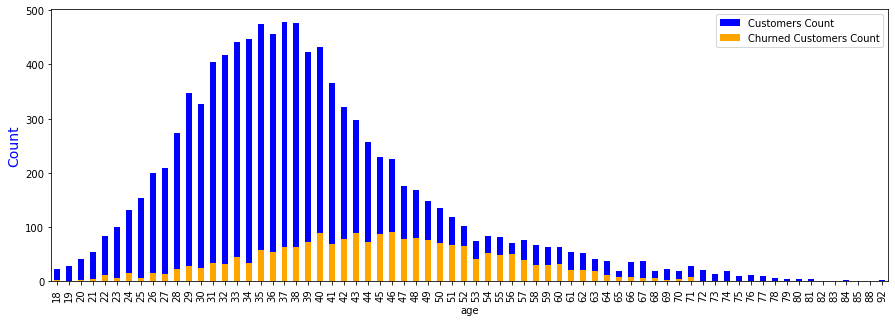
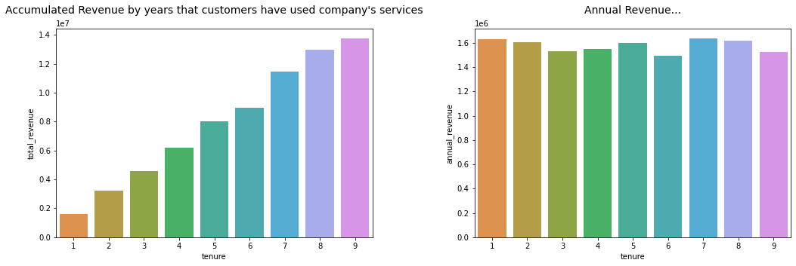
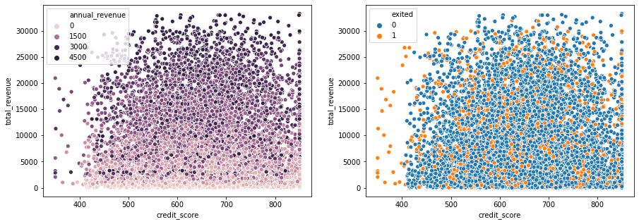

## Reducing the rate of customer turnover (CHURN).   
   
        1 - Context of the Problem.
        2 - Results.
        3 - Insights and some Highlights.
        4 - Improvements. What could I do differently?
            Resources

[DataSet.](https://www.kaggle.com/mervetorkan/churndataset)  
[Analysis](https://nbviewer.jupyter.org/github/pauloreis-ds/Projetos/blob/master/classification-churn/notebooks/topBank.ipynb) 
[ML Modeling](https://nbviewer.jupyter.org/github/pauloreis-ds/Projetos/blob/master/classification-churn/notebooks/topBankModel.ipynb)

## 1. Context of the Problem.

        TopBank is a large banking services company. It operates mainly in European countries offering financial
        products, from bank accounts to investments, including some types of insurance and investment products.

        The company's business model is a service type, that is, it sells banking services to its customers through
        physical agencies and an online portal.

        The company's main product is a bank account, in which the customer can deposit his salary, make withdrawals,
        deposits and transfer to other accounts. This bank account has no cost to the customer and is valid for 12 
        months, that is, the customer needs to renew the contract of that account to continue using it for the next
        12 months.

        According to the TopBank Analytics team, each customer who has this bank account returns a monetary value of
        15% of the value of their estimated salary, if it is less than the average and 20% if this salary is higher 
        than the average, during the current period of your account. This value is calculated annually.

        For example, if a customer's monthly salary is 1,000.00 EUR and the average of all bank wages is 800 EUR. 
        The company, therefore, invoices 200 EUR annually with this client. If this customer has been in the bank 
        for 10 years, the company has already earned 2,000.00 EUR from its transactions and account usage.

        In recent months, the Analytics team realized that the rate of customers canceling their accounts and 
        leaving the bank reached unprecedented numbers in the company. Concerned about the increase in this rate,
        the team devised an action plan to reduce the rate of customer evasion.

        Concerned about the drop in this metric, TopBank's Analytics team hired you as a Data Science consultant to
        create an action plan, with the objective of reducing customer evasion, that is, preventing the customer from
        canceling his contract and not renew it for another 12 months. This evasion, in business metrics, is known as
        Churn.

        In general, Churn is a metric that indicates the number of customers who have canceled the contract or have
        stopped buying your product within a certain period of time. For example, customers who canceled the service
        contract or after it expired, did not renew it, they are considered churn customers.

        Another example would be customers who have not made a purchase for more than 60 days. These customers can be
        considered churn customers until a purchase is made. The 60-day period is completely arbitrary and varies
        between companies.

#### The challenge
As a Data Science Consultant, you need to create an action plan to decrease the number of churn customers and show the financial return on your solution.

**At the end of your consultancy, you need to deliver to the TopBank CEO a model in production, which will receive a customer base via API and return that same base scored, that is, one more column with the probability of each customer entering into churn.**

In addition, you will need to provide a report reporting the performance of your model and the financial impact of your solution. Questions that the CEO and the Analytics team would like to see in their report:

    What is TopBank's current Churn rate? How does it vary monthly?
    What is the model's performance in classifying customers as churns?
    What is the expected return, in terms of revenue, if the company uses your model to avoid churn from customers?

A possible action to prevent the customer from churning is to offer a discount coupon, or some other financial incentive for him to renew his contract for another 12 months.

Which customers would you give the financial incentive to and what would that amount be, in order to maximize ROI (Return on Investment). Recalling that the sum of incentives cannot exceed 10,000.00 EUR

---   

## 2. Results

Observation: There are many ways to calculate the churn rate. One of them is: 

    Quantity of customers lost in a period divided by the quantity of customers in the beginning of that period.

I called it "__General Churn__". However, in some cases, it makes more sense to calculate the churn rate within a specific group.  
In this case the formula is the same, but it's going to be refering to a category/group, instead ot the whole amount of customers.
    
    Example:                        
                                    10,000 customers 
    
             5,000 from France     2,500 from Germany          2,500 from Spain
             
    Depending on the approach we use, maybe we want to know the general churn...
             
             Churned in France / 10,000
    
    ...or the internal churn rate:
             
             Churned in France / 5,000

ps: there are more formulas we could discuss about, but for this project those two will do.

 
 

- **What is TopBank's current Churn rate? How does it vary monthly?**

        General Churn Rate:        20.51%
           Active Members Churn:    07.51%
           Inactive Members Churn:  12.99%

        From Active and Inactive Groups
           Active Members Churn:    14.41%
           Inactive Members Churn:  26.86%
          
> Since there are no dates or a clear linear timeline to follow  
> We can't tell how the churn rate varies monthly. We can look at  
> churn rates among the years customers have been clients of  
> TopBank, but we don't know the actual year for the customer  
> who stayed 1 year, for example (was he a client in 2020? 2019?  
> 2018?). Thus, we don't have a real a timeline.

  

 

- **What is the model's performance in classifying customers as churns?**

        We want to be able to figure out accurately which customer is going to churn. 
        Therefore, recall is the metric that best fits this problem.

> **_From those who were churned customers, how many did the model detect?_**

        88% of churned customers is detected as churned customers.

- **What is the expected return, in terms of revenue, if the company uses your model to avoid churn from customers?**

> Churn rate being around 20% and customers quantity of 10,000, meaning 2,000 may churn...  
> and an expected annual revenue per customer as 1,658.00 EUR.
            
            In the best case scenario:
            
                If TopBank, knowing that a customer is going to leave the company, 
                can prevent that from happening...

                It's expected for the bank to (re)gain 2,918,474.51 EUR with those customers.
                
> **In the worst case scenario this value would be about 24,495.35 EUR**  
> You can check the mindset for the calculation at the end of [topBankModel notebook](https://nbviewer.jupyter.org/github/pauloreis-ds/Projetos/blob/master/classification-churn/notebooks/topBankModel.ipynb)

**_You can check out the [Web App](https://share.streamlit.io/pauloreis-ds/topbankstreamlit/main/app.py) and see the model in action._**

---   

## 3. Insights and some Highlights.

### **_Churned customers._**

> **Most of churn rate comes from people of age between 38 - 52.  
> TopBank is losing people at their professional peak.**  
> And most of not churned customers are in between 28 - 42.  

    

> Most revenue comes from customers of age between 29 - 43  
> which means big losses from 38 to 43 (**they represent 4.6%  
> of revenue lost annually**, approximately 720,000.00 EUR).

  
  

- **_Maybe TopBank should create new products/services... or adapt the existing ones to better fit those._**

 
 

### _Customers who are active members have lower churn rate._

> **55% of total revenue comes from active members. However,  
> 14% of them may churn. Which means 7.7% of annual revenue  
> is being lost** (approximately 1,200,000.00 EUR).
>
> **45% of total revenue comes from inactive members and 27%  
> of them may churn. Therefore, 12% of annual revenue is  
> being lost** (approximately 1,900,000.00 EUR).

- **_Thereby, creating an action plan focus on turning the customers into active members seems great.  
 Of course, It would depend on its cost when compared to the cost and gains from other planings._**

 
 

### _Customers who buy more products have lower churn rate._
                
> Yes, but the general churn rates of those are lower because there are many   
> less customers who buy many products. Thus, after solving this imbalance  
> in data, we found out that: **If TopBank had the same amount of customers**  
> **buying from each "number of product" category... in the best case scenario**  
> **(5084 customers per category, meaning a total of 20336 customers), the churn**  
> **for each category would be around:**

        Number of Products    Churn Rate
                1                  7%
                2                  2%
                3                 20%
                4                 25%

- **That tell us that if customers start buying more products, TopBank is going to lose many more customers.** 

- **Otherwise, if TopBank gains  more customers, its going to lose much more revenue, since customers who buy 
    more products are also going away much more.** 
    
> Customers who buy 1 product are responsible for most revenue (around 50%),  
> mainly because there are more of them, but customers who buy 2 products  
> (around 46%) are the ones who may take the lead someday. While sales in  
> which there are 3 or 4 products tends to happen a lot less often.

 
 

### _The longer the customer stays with the company, the greater is the revenue?_

> Yes. However...  
> **Actually, the annual gains are pretty similar,  
> so in the long term, yes, the accumulated value  
> increases, but that doesn't mean the customer  
> buys more products or spends more money on  
> the company.**

  

 

     

### Customers with credit card have a lower churn rate.
                
> No, and also, **the rates within the groups are quite equals (20%), besides, 
> as there are more customers with credit card (70%), that is a bad sign  
> because it means TopBank is losing many potential good customers,  
> with greater engagement.**
>
> Though the customers with credit card are the most responsible for revenue  
> gains, they are also in much more quantity, more than the double. Then, after 
> dealing with this imbalance in data, if there were the same amount of customers  
> with and without credit card, it seems that those with no credit card would  
> be the ones who would bring more revenue

### Higher credit score doesn't mean more revenue.

    If that so, we would see the color getting darker from left to right.
    

  

 

     

### Which country does the biggest revenue come from?

                 Revenue
        France     49%
        Germany    25%
        Spain      24%

> France, and one more time: imbalanced data, half of customers are located there.  
> **Balancing the data, Germany seems to be the right place to invest on.** Even because...

        "Germany really seems to have high quality customers. So the fact that it has a churn rate 
        too high is really sad. Probably TopBank will have to apply a specific action plan there."
        

## Some assumptions done while exploring...

_Some we can't tell if they're true, but if we could, those would help us to understand better what's happening and how it affects the phenomenon._
    
    1.2.2. Categorical Attributes
        
    So far, boxplots are pretty similar and the one which gets my attention is the "balance" one.
    Even though the salaries among the countries are quite similar, people in Germany, in general,
    has a greater balance account. Does it mean a better financial education? Anyways, it might 
    also mean that by losing a customer from Germany there's a high chance of losing a good customer.

    5.1.2. Numerical Variables

        Credit Score

    The credit score distribution kind of tends to high values (the boxplot in 1.2.2.Categorical Attributes
    shows that too, but to really validate this We should talk to an expert from TopBank, then We could know
    exactly which value the company considers high). 

    50% of customers have a score above the mean, so when a customer leaves TopBank there's a good chance the
    company is losing a high quality customer.
  
  
        Tenure

    "Tenures" are similar. If people are leaving at different times, it might be they're facing problems on 
    different services (we could also try to categorize by different types of customers... anyway, it's a
    whole new analysis), thus the enterprise would have to improve in more than just "some services"... As you
    can see, the histogram shows fewer people that churn in less than 1 year (0) and after 10 years (which doesn't
    make sense?), this probably happens because of the season the data started to be collected (mid-year, perhaps?)
    and when it was finally sent to analysis. Again, expertise domain from the company would really help (as well
    as more data representing other information, such as dates, products and so on).
    
    
        Balance

    Similar assumption to Credit Score's. Losing a customer with high balance might be a situation we want to
    avoid. It's weird the fact that there're many accounts with 0 as balance.
    Number of Products

    Most of the customers consume 1 or 2 products. It would be good to ask the company which products are these
    to try to understand why this happens. Do people buy 1, 2 and then stop buying? Is it an aftersales problem?
    Or is is a normal phenomenon?
      
      
        Credit Card

    Most customers have credit card (70%). This can be good or bad, depending on how much the company wishes to gain
    from it (besides the "maximum gain" ideal) and depending on which metric they would use to measure that gain.
    But in general, it seems good.

    If customers with credit card bring higher revenue, there's also a high chance TopBank is losing good customers
    when they leave.
    Active Members

    We have an almost equal number of active and non-active members, not a very good sign if non-active members are
    the ones who leave the company in higher rates. We might want to investigate that later trying to understand why.
       
       
        Salary (annual_revenue, revenue_per_product, total_revenue)

    There is some quantity of salary with very low values... outliers, which affects features as
    annual_revenue, revenue_per_product and total_revenue. Those are basically telling us that most of 
    company's revenue comes from lower prices products (this might be a misinterpretation, though. Since
    we don't really know the actual prices for each product).
    
    
        Geography

    France has twice as many customers as Germany. But Germany has twice the churn rate. This is kind of scary,
    but it may mean that TopBank should apply a different marketing plan there or those customers should receive 
    other services. As usual, communication with people with domain knowledge could guide our decisions here 
    (in case we decide to investigate this event deeper).
        
            
---

## 4. Improvements. What could I do differently?
    
**1 - Germany - France - Spain**

Analyzing more in depth the "geography" category. A deeper study about what the data tell us about what's happening in each country could give us very useful information. TopBank's next steps could be towards that direction.
    
**2 - More Types of Data.**

Some assumptions requires different types of data to be available, as information about the products or dates showing when the customer arrived or left. In case, TopBank didn't have some, it would be a great advise telling them to start collecting them. Then, in the future this data would be well used.

**3 - Customer Clusters**

A cluster analysis in favor of clients understanding may also be a later project to be implemented here. Identifying structures within the customer data could lead us to better understanding of who and why is leaving. There might not be enough data for this, though. I'm not really sure.

**4 - Inactive Members**

Since inactive members are prone to leave TopBank, an analysis focused on predicting which member is going to be inactive and how to change that situation can bring considerable results to the bank.
    
---   

[Web App Code](https://github.com/pauloreis-ds/topBankStreamlit)

    Resources: Python 3.7. Pandas, Numpy, Matplotlib, Seaborn.
               Inflection, Scipy, Sklearn, Smote.
               Streamlit.
   
   

---
